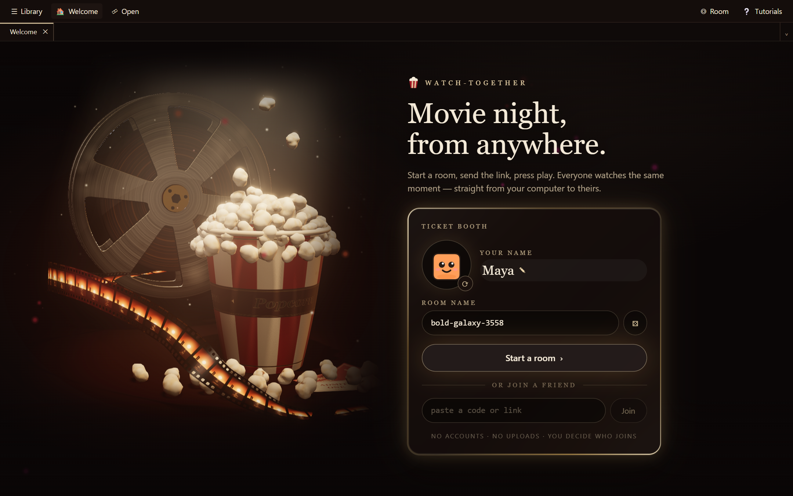
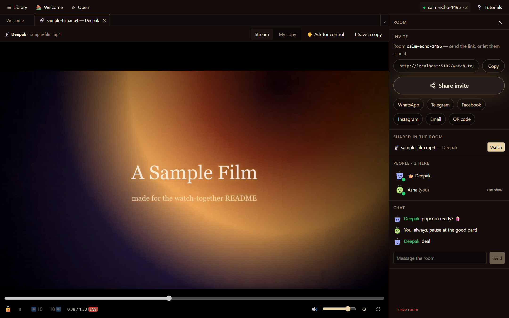
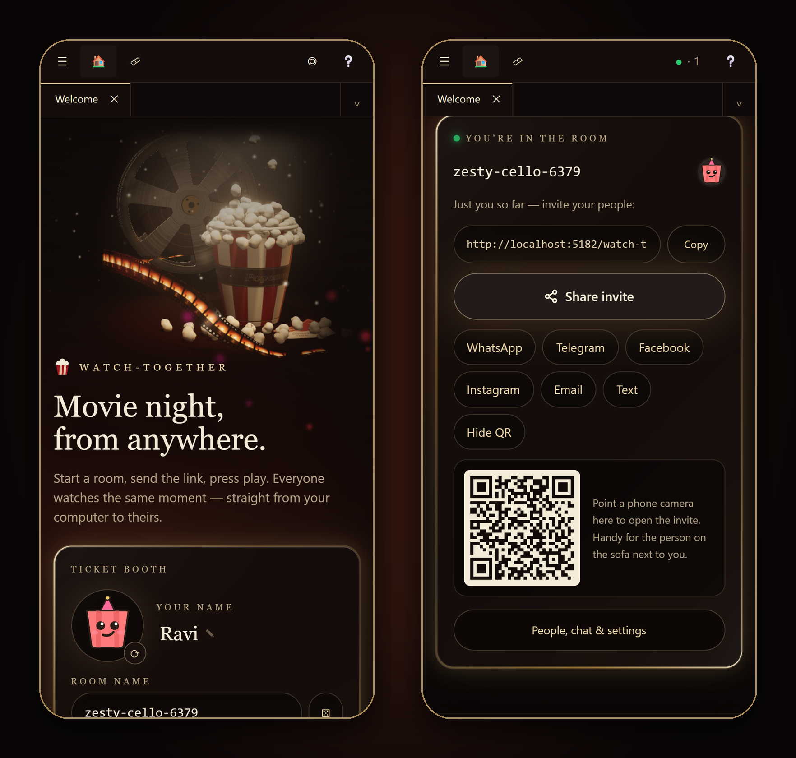

<h1 align="center">🍿 watch-together</h1>

<p align="center">
  <strong>Movie night, from anywhere.</strong><br />
  Start a room, send the link, press play — everyone watches the same moment, straight from your computer to theirs.
  No accounts, no uploads, no server.
</p>

<p align="center">
  <a href="https://theclearsky.github.io/watch-together/"></a>
</p>

<p align="center">
  <a href="https://github.com/TheClearSky/watch-together/actions/workflows/pages.yml"></a>
  
  
  
  <a href="./LICENSE"></a>
</p>

<p align="center">
  <a href="https://theclearsky.github.io/watch-together/">Open the app</a> ·
  <a href="#how-it-works">How it works</a> ·
  <a href="#features">Features</a> ·
  <a href="#privacy">Privacy</a> ·
  <a href="#browser-support">Browsers</a> ·
  <a href="#develop">Develop</a> ·
  <a href="#built-with">Built with</a>
</p>

<p align="center">
  
</p>

---

## Three clicks to movie night

1. **Start a room.** Your name, face and a room name are already filled in — change any of them, or don't.
2. **Send the link.** One button opens your phone's share sheet (or copies the link); WhatsApp, Telegram, Facebook,
   Instagram, email and a QR code are right there too.
3. **Press play.** Open a video from your computer and share the tab. Your friends see it in sync — and anyone who has
   the same file plays their own copy, perfectly in step with yours.

<p align="center">
  
</p>

## Features

|  |  |
|---|---|
| 🎬 **Two ways to watch** | **Stream** — friends receive your playing tab live, video and audio. **My copy** — anyone with the same file plays it locally at full quality; play, pause and seek stay in sync (the app recognises the file and offers the switch). |
| 🔊 **Your own volume** | Volume, mute and subtitles are each person's own. Turn it down without turning it down for everyone. |
| 🚪 **You decide who gets in** | People knock; you — or helpers you pick — let them in. Choose who may share a tab: everyone, nobody, or per person. Hand ownership on, or remove someone. |
| 🎮 **Share the remote** | Viewers can ask for control; the sharer allows it and takes it back any time. Switch tabs and the shared video keeps playing for everyone. |
| ⬇️ **Save a copy** | Ask the sharer for the file itself: it arrives peer to peer, checked block by block, into your library — then play your own copy in sync. |
| 💬 **Subtitles, styled** | `.srt` / `.vtt` next to the video, or loaded by hand; subtitles inside MKV files — styled ASS, fonts and all — show for everyone, even people watching the stream. |
| 📁 **Your library** | Open single files in any browser, or link a whole folder (read-only or read & write) and browse it in VS Code-style tabs that remember where you stopped. |
| 🎟️ **Made to be shared** | Avatars that travel with your name, one-click invites, a QR code for the person on the sofa, link previews in chat apps, room chat. |
| 📱 **Phones too** | Fully responsive, touch-friendly, fullscreen and landscape on rotate. |
| 🍿 **Pop, your guide** | A popcorn bucket walks you through any part of the app, step by step — only when you ask (top-right **Tutorials**). |

<p align="center">
  
</p>

## How it works

```
  you                                                        your friends
┌─────────────┐   who's here? (encrypted, signed)   ┌─────────────┐
│  browser A  │ ◄───────── public Nostr relays ────► │  browser B  │
│             │        (only to find each other)     │             │
│  your file  │                                      │             │
│     ▼       │ ════ WebRTC, directly between you ══►│  ▶ stream   │
│  <video>    │   video · audio · play/pause/seek    │  or ▶ their │
│             │   chat · subtitles · file copies     │   own copy  │
└─────────────┘                                      └─────────────┘
```

- **Rooms** are found through public [Nostr](https://nostr.com) relays with [Trystero](https://github.com/dmotz/trystero).
  The relays only ever see a hash of the room name, and the connection details exchanged there are encrypted with a
  key derived from it.
- **Everyone has a key pair** made in the browser. Joining is a signed handshake; letting someone in is a signed
  ticket; the owner signs the room's state (members, who may share, who is banned). Nobody can impersonate the owner
  or sneak in.
- **Video, audio, commands, chat and file copies** travel over WebRTC, directly between browsers.
  *Stream* sends your playing tab (`captureStream`, your own volume split off with Web Audio); *My copy* keeps each
  person's local file in step with a synced clock and gentle speed nudges.
- **The app is a static site** — HTML, JS and CSS on GitHub Pages. There is no backend to run, pay for, or trust.

## Privacy

- **Your videos never upload.** They go from your disk to your friends' browsers and nowhere else. Files you link
  stay where they are; nothing is copied unless you ask for it.
- **No accounts, no tracking, no analytics.** Your name, face and room live in your own browser's storage.
- **Relays see almost nothing:** a hashed room name and encrypted connection offers — not who you are, not what you
  watch.
- **Chat is ephemeral**: it lives only in the open pages.
- **One caveat:** with no relay server for media (no TURN), two people behind very strict networks (some corporate or
  mobile carriers) may not be able to connect directly.

## Browser support

| | Chrome / Edge | Firefox | Safari |
|---|---|---|---|
| Rooms, chat, watching a stream | ✅ | ✅ | ✅ |
| Open a video file, play your own copy | ✅ | ✅ | ✅ |
| Share a tab (stream it to others) | ✅ | ✅ | ✅ (recent) |
| Link a whole folder | ✅ desktop | — | — |

What plays depends on the browser's codecs (MP4/H.264 everywhere; MKV in Chrome and Edge).

## Develop

```sh
npm ci
npm run dev          # http://localhost:5173/watch-together/
```

| Script | What it does |
|---|---|
| `npm run type-check` | TypeScript, strict |
| `npm run test:unit` | 186 unit tests (rooms and their signed handshake, sharing, sync, file transfer, subtitles, tutorials) |
| `npm run build` | type-check → production build → a check that no two bundles import each other in a circle |
| `npm run preview` | serve the production build |

Every pull request is built by CI; every push to `main` deploys to GitHub Pages — CI is the only deploy path.

## Built with

- **[easy-folder-management-ui](https://github.com/TheClearSky/easy-folder-management-ui)** ([npm](https://www.npmjs.com/package/@theclearsky/easy-folder-management-ui)) — the file library, tabs, dialogs and their theming; extracted from this app and Nodestra.
- **[easy-tutorial-builder](https://github.com/TheClearSky/easy-tutorial-builder)** ([npm](https://www.npmjs.com/package/@theclearsky/easy-tutorial-builder)) — the guided tours Pop runs on.
- [Trystero](https://github.com/dmotz/trystero) (peer discovery over Nostr), [three.js](https://threejs.org) (the
  Welcome page's procedural cinema scene), [JASSUB](https://github.com/ThaUnknown/jassub) (styled subtitles),
  [React](https://react.dev), [Vite](https://vite.dev), [Tailwind CSS](https://tailwindcss.com), [zod](https://zod.dev),
  [uqr](https://github.com/unjs/uqr).

Third-party licenses ship with the site: [THIRD_PARTY_LICENSES.txt](https://theclearsky.github.io/watch-together/THIRD_PARTY_LICENSES.txt)
(generated from each package's own files) and [THIRD_PARTY_NOTICES.txt](./public/THIRD_PARTY_NOTICES.txt) (the subtitle
renderer's native components).

## License

MIT © 2026 Deepak Prasad — see [LICENSE](./LICENSE).
